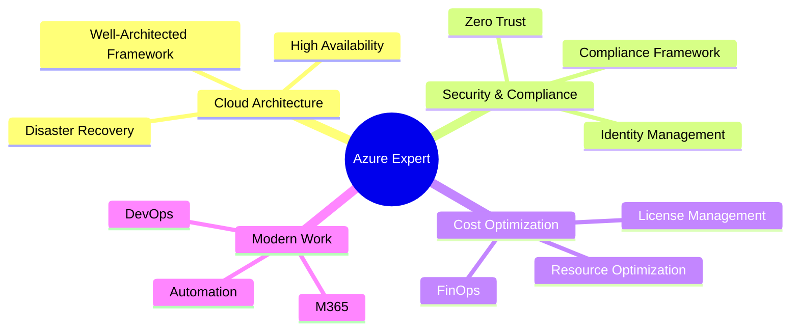

# Mathews Buzetti | Azure Solutions Architect 🚀

## 💫 Sobre Mim

> Arquiteto de Soluções Microsoft Azure especializado em transformação digital e Modern Work & Security. Combinando visão estratégica com expertise técnica para entregar soluções cloud robustas e inovadoras.

## 🛠️ Tech Stack

### Cloud & Infrastructure

### DevOps & Automation

### Monitoring & Observability

## 🎓 Certificações

## 🏆 Especialidades

- **Arquitetura Cloud Azure**
  - Desenho de soluções escaláveis e resilientes
  - Implementação de arquiteturas multi-region
  - Otimização de performance e custos

- **Modern Security**
  - Zero Trust Architecture
  - Identity & Access Management
  - Security Center & Sentinel
  - Compliance & Governance

- **DevOps & Automation**
  - CI/CD Pipelines
  - Infrastructure as Code
  - Configuration Management
  - Container Orchestration

## 📈 GitHub Stats

## 🌟 Principais Projetos

### [azure-infrastructure-template](https://github.com/mathewsbuzetti/azure-infrastructure-template)
- Template IaC (Infrastructure as Code) para deploy completo de ambiente Azure
- Implementação de Máquinas Virtuais, Networking e VPN Gateway
- Features de Backup e Automação
- Interface web para fácil gerenciamento
- **Tech Stack:** PowerShell, Azure ARM Templates

### [azure-securonix-deployment](https://github.com/mathewsbuzetti/azure-securonix-deployment)
- Template ARM para criação de VM Oracle Linux
- Configurações específicas para Securonix
- Implementação de práticas de segurança
- Automação de deployment
- **Tech Stack:** ARM Templates, Linux, Security Best Practices

## 📫 Contato

Para consultorias, projetos ou parcerias, entre em contato através do LinkedIn.

---

> "Apaixonado por tecnologia, educação e por mudar a vida das pessoas através da inovação digital." 🚀

